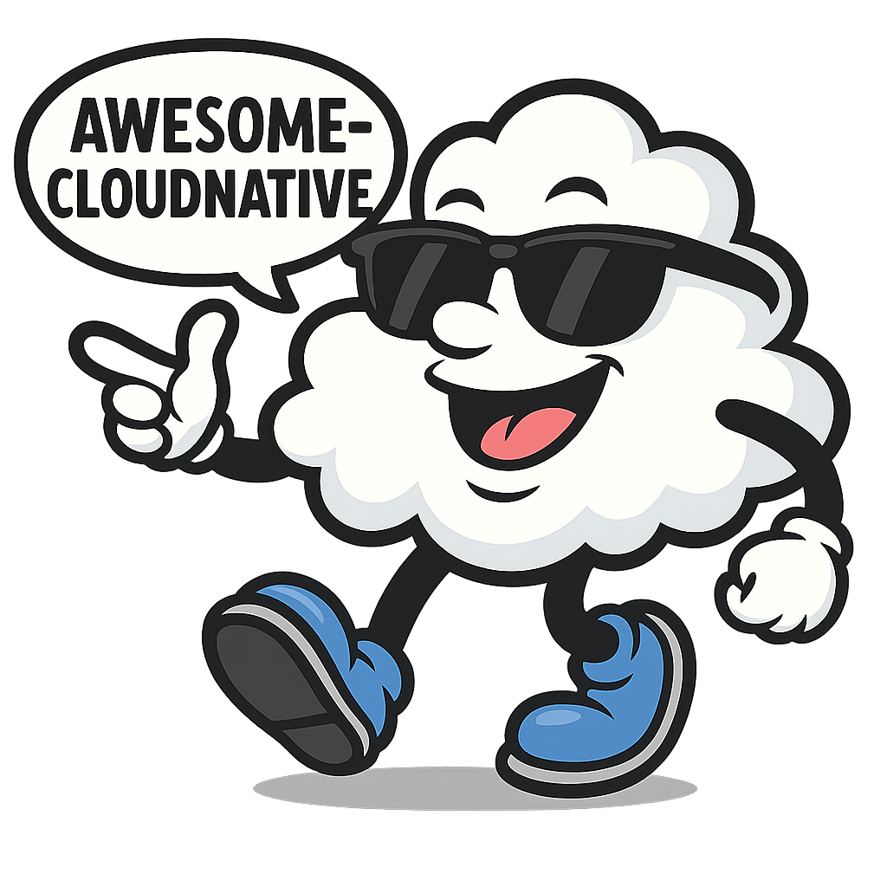

<h1 align="center">❑ <code>awesome-CNCF</code></h1>


```json
{
  "cloudNative": true,
  "resources": "ephemeral",
  "awesomeLists": "forever"
}
```
<p align="center"> <br><br> </p>

---

&nbsp;  

### ➩ Development 

- [Podman Desktop](https://github.com/podman-desktop/podman-desktop.git)
- [Devfile](https://github.com/devfile/api.git)
- [Backstage](https://github.com/backstage/backstage.git)
- [ko](https://github.com/ko-build/ko.git)


### ➩ Supply Chain Security

- [sigstore](https://github.com/sigstore/cosign.git)
- [Dependency-Track](https://github.com/DependencyTrack/dependency-track.git)


### 

